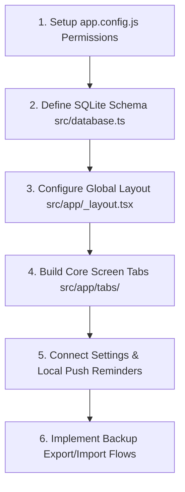

# Physio Tracker 🚗

Physio Tracker is a premium, offline-first mobile application designed specifically for independent physiotherapists to manage patient details, schedule home visits, track financial history, and receive local alarm reminders. 

Built using **React Native**, **Expo SDK 52**, **TypeScript**, and **SQLite**, the app operates completely offline, ensuring data privacy and instant performance.

---

## 📱 Key Features & Modules

### 1. Today Dashboard (Home)
*   **Daily Schedule at a Glance:** Highlights the number of remaining appointments scheduled for the current day.
*   **Financial Metrics:** Instantly displays total outstanding/pending dues across all patients.
*   **Global Settings:** Custom settings for:
    *   Doctor Name, Clinic Name, and Specialization.
    *   Working hours range and selectable working days of the week.
    *   Default currency symbol and timezone.
    *   Appointment reminders threshold (configurable minutes prior to visit).
    *   Payment reminder frequency configuration.
    *   Time-conflict buffer setting (e.g., alert if visits overlap within 60 minutes).
*   **Notification Banners:** Displays an active warning banner if local notification permissions are disabled in the phone settings, with a quick-link button directing the user to system settings.
*   **Unlock License:** Integrated premium feature gate verified via license code validation.

### 2. Interactive Visit Calendar
*   **Daily Grid View:** Displays appointments grouped by selected date.
*   **Smart Scheduling:** Pre-fills the date based on your active selection in the calendar grid.
*   **Time-Conflict Warnings:** Checks existing appointments on the selected date and warns the doctor if scheduling a new visit conflicts with another visit based on the configured time-conflict buffer.
*   **Validation Rules:**
    *   Prevents scheduling or editing appointments to a date/time in the past (includes a 5-minute grace window for quick logging).
    *   Edits or reschedules automatically reset the visit status back to `'Scheduled'`.
*   **Status Management:** Tap any appointment card to trigger an action sheet to mark the visit as **Completed**, **No-Show**, or **Cancelled**.
*   **Billing Safeguards:** If you delete a completed visit, the app warns you that its completed payment history and outstanding due log will be permanently deleted.
*   **Recurring Series:** Schedule recurring appointments (Daily, Weekly, or Monthly) with automatic batch insert.

### 3. Patient Directory
*   **Searchable Directory:** Instantly filter patients by typing any part of their name or ailment.
*   **Read-Only Profile View:** Tapping a patient card opens a clean, detailed read-only sheet showing:
    *   Onboarded Date & Total Sessions Completed.
    *   Diagnosis, medical history, and clinical case notes (limited to 150 characters for clean layouts).
    *   Referred Doctor, default session fee, and address.
*   **Dedicated Profile Editor:** Separate editor sheet (accessed via edit pen icon) to modify phone, fee, or clinical notes.
*   **High-Performance In-App Contact Search:**
    *   Import contact details (Name and Phone) directly from your phone's address book.
    *   Uses **On-Demand Android Native Indexing** (`expo-contacts/legacy`) to query only matching results as you type. This keeps search instantaneous and uses zero persistent memory, handling lists of **5,000+ contacts** with ease.
    *   **Security Filter:** Automatically sanitizes search inputs to strip out any special characters (allowing only letters, numbers, and spaces) to prevent injection vectors.

### 4. Billing Ledger & Payment History
*   **Outstanding Dues:** Lists all patients with outstanding pending balances.
*   **Manual Payments Ledger:** Record full or partial payments collected for any completed visit or due balance.
*   **Patient Billing History:** A detailed sliding ledger modal displaying every visit fee and payment transaction log, supporting Android's hardware back key dismissals.
*   **WhatsApp Reminders:** One-tap button to open WhatsApp and pre-fill details with:
    *   Appointment reminders (with patient name, date, time, and address).
    *   Payment reminders (detailing visit dates, fees, and outstanding balance).

### 5. Local Push Reminders
*   **Offline Notifications:** Automatically registers a local OS notification for scheduled visits on the phone.
*   **Configurable Timings:** Fires exactly at the configured threshold (e.g. 60 minutes) prior to the visit.
*   **SDK 52 Compliant:** Wrapped inside the new `SchedulableTriggerInputTypes.DATE` trigger schema to ensure high reliability on modern Android and iOS notification engines.

### 6. Robust Backup & Restore
*   **Full WAL Checkpoints:** Before exporting, the database executes a full checkpoint (`PRAGMA wal_checkpoint(FULL);`). This guarantees all recent appointments are flushed from temporary system cache files directly into the `physio_tracker.db` file.
*   **Secure System Share:** Packs the compiled database file and launches the OS sharing tray to save to Google Drive, Email, or Local Files.
*   **Stale Journal Cleanup:** On restore, the connection is closed programmatically, and **all old SQLite files** (`.db`, `-wal` logs, and `-shm` indexes) are deleted before copying the backup file. This prevents database mismatches and ensures the restored data is rendered immediately on the screen.

---

## 🛠️ Technology Stack
*   **Frontend Framework:** React Native with Expo (SDK 52)
*   **Language:** TypeScript
*   **Database:** SQLite (`expo-sqlite`)
*   **Navigation:** File-based routing (`expo-router`)
*   **File System:** New Expo File System API (`File`, `Directory`, `Paths` classes)
*   **Reminders:** Local Push Notifications (`expo-notifications`)
*   **Address Book:** Phone contacts (`expo-contacts/legacy`)
*   **UI Components:** React Native Core Components with custom Vanilla CSS styles (Glassmorphic touches, blue-accent branding).

---

## 🛠️ Developer Workspace Setup & Evolution Guide

This guide is designed for developers setting up their workspace to maintain this application or build a similar offline-first Expo project.

### 1. Development Workspace Setup
To set up a local workspace identical to the one used for this project:

1.  **Prerequisites:**
    *   Install **Node.js** (LTS v20+ recommended).
    *   Install **Git**.
    *   Install the **EAS CLI** globally to manage React Native binary builds:
        ```bash
        npm install -g eas-cli
        ```
2.  **IDE Setup (VS Code Recommended):**
    *   Install the **Expo Tools** extension (adds autocomplete and debugging for `app.json` / `app.config.js`).
    *   Install a **SQLite Viewer** extension (to inspect local database tables during emulator runs).
3.  **Local Project Initialization:**
    *   To start a project like this from scratch, run:
        ```bash
        npx create-expo-app@latest ./ --template tabs-ts
        ```
    *   This sets up the file-based Expo router with TypeScript templates.
4.  **Install Required Native Libraries:**
    ```bash
    npx expo install expo-sqlite expo-file-system expo-notifications expo-contacts expo-sharing expo-document-picker @react-native-community/datetimepicker
    ```

---

### 2. Development Evolution (How We Proceeded)

To build this app, we followed a structured, dependencies-first architecture:



#### Step 1: Native Permissions Configuration
Define required hardware access keys inside `app.config.js` so they compile cleanly in Android Manifest and iOS Info Plists:
*   `NSContactsUsageDescription` and `android.permission.READ_CONTACTS` (Contacts).
*   Notification configurations (Local Push Notifications).

#### Step 2: Database Initialization (`src/database.ts`)
Create a single schema controller file. Establish SQLite connections and define SQL table creation queries (`Patients`, `Appointments`, `Payments`, `Settings`). 
*   **Crucial Rule:** To ensure database connections don't get locked during backup restoration, export a dynamic `getDb()` function that returns the active instance lazily, along with a `closeDb()` utility to programmatically close the file connection before restoration.

#### Step 3: Layout Launcher (`src/app/_layout.tsx`)
Configure the global entry point. On startup, initialize push notification handlers (`Notifications.setNotificationHandler`), request initial system permissions, and call `initDatabase()` to run initial SQL tables creation/migrations.

#### Step 4: Screen Routines (`src/app/(tabs)/*`)
Write screen UI layouts utilizing custom StyleSheet CSS classes. Use the `useFocusEffect` react hook on screen views to query the local SQLite database and load records dynamically every time the tab comes into focus.

#### Step 5: Native Bridges Integration
*   **Searchable Contacts Importer:** Implement a custom searchable FlatList modal. Query matching phone entries on-the-fly using `Contacts.getContactsAsync({ name: query })` to keep memory consumption low with large contact databases. Use `expo-contacts/legacy` to bypass SDK 52 deprecated standard imports.
*   **Backup WAL Checkpoints:** Set up backup routines. Flush in-memory records using `PRAGMA wal_checkpoint(FULL);` before file copying. Remove stale `.db`, `-wal`, and `-shm` files during restoration to ensure clean state loads.

---

### 3. Key Development Guidelines for Future Enhancements

*   **Offline Connection Pooling:** Never store SQLite connection handles in global constant variables in screen files. Always use `getDb().runSync(...)` or `getDb().getAllSync(...)` within the local functions to ensure the active connection is fetched dynamically.
*   **Database Schema Updates:** When adding a new column to tables in future development, wrap them in clean `try/catch` blocks inside `initDatabase()` so existing local databases migrate without crashing:
    ```typescript
    try {
      database.execSync('ALTER TABLE Patients ADD COLUMN new_column_name TEXT;');
    } catch(e) { /* Column already exists */ }
    ```
*   **Android Hardware Back Key Support:** When adding new views using React Native's `<Modal>` component, always supply the `onRequestClose` prop:
    ```typescript
    <Modal visible={visible} onRequestClose={() => setVisible(false)}>
    ```
    This ensures that Android hardware back buttons dismiss the overlay sheet cleanly instead of locking the UI.
*   **EAS Preview Compilations:** Native hardware accesses (like local notifications registers or contacts address lists) cannot be fully tested inside Expo Go. Always test updates by compiling standalone APK binaries:
    ```bash
    npx eas-cli build -p android --profile preview
    ```

---

## 🚀 Getting Started

### 1. Install Dependencies
Make sure you have [Node.js](https://nodejs.org/) installed, then run:
```bash
npm install
```

### 2. Start the Development Server
```bash
npx expo start
```
*Press `a` to run on an Android emulator or device, or `i` for iOS.*

### 3. Build a Preview APK (Android)
To compile a standalone preview build of the application using EAS:
```bash
npx eas-cli build -p android --profile preview
```

---

## 🔒 Security & Privacy
*   **Zero Cloud Sync:** No patient data, diagnosis notes, or financial history is transmitted to any cloud servers. Everything is stored locally on the device.
*   **Input Sanitization:** Contact search input fields automatically filter out special characters to block query manipulation or injection exploits.
